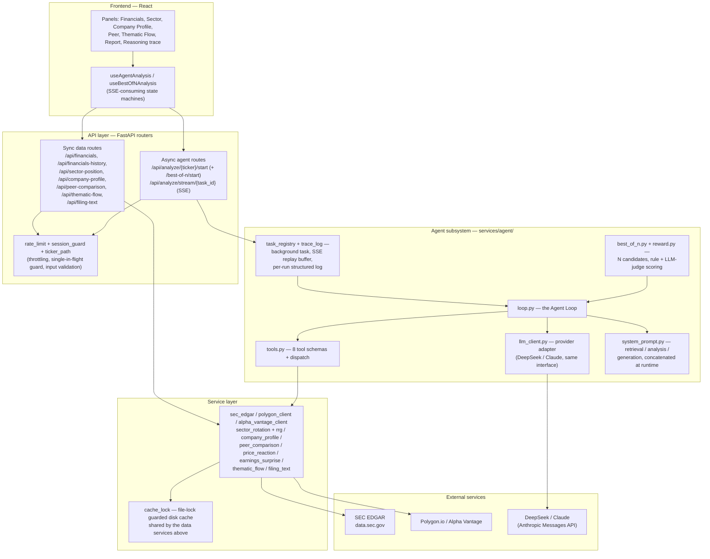
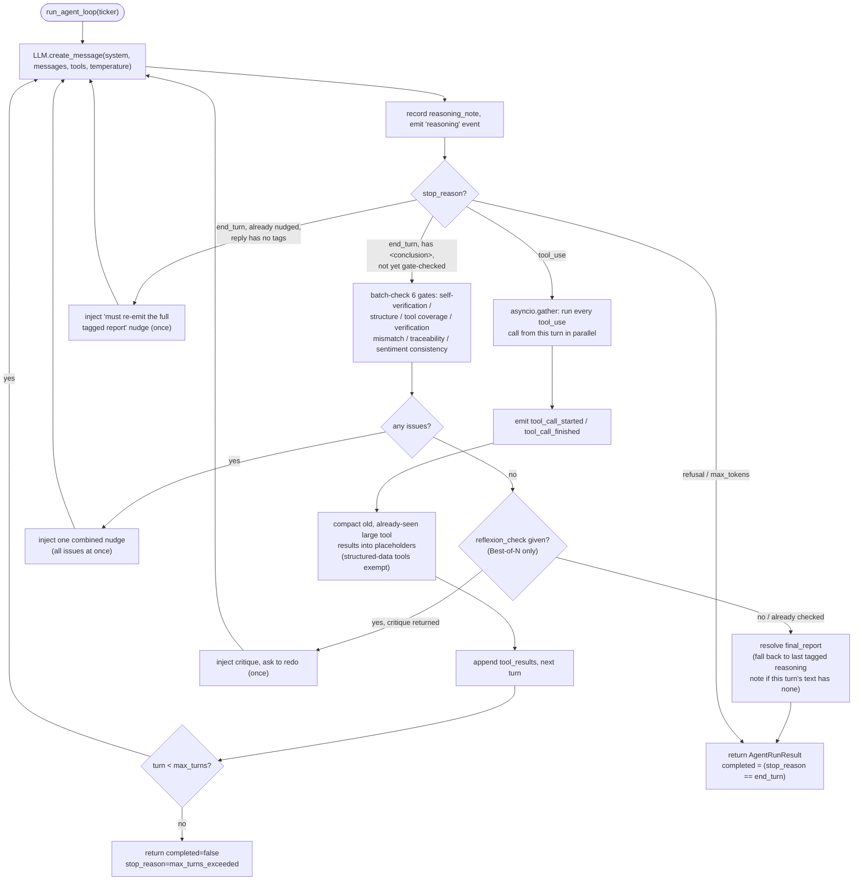
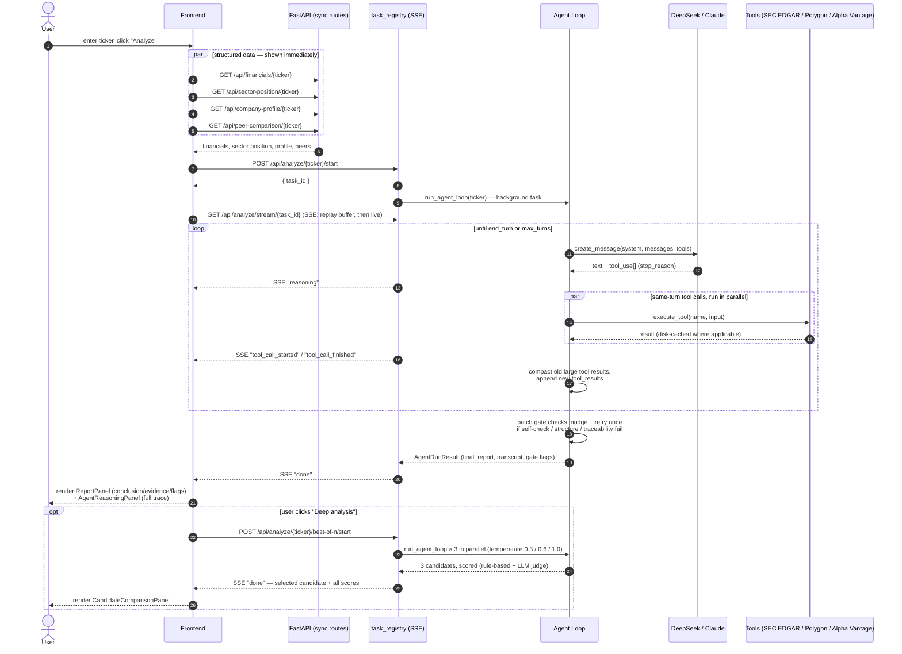

# US Equity Research Agent

An LLM agent that autonomously calls tools to research a US-listed stock —
pulling SEC EDGAR financials, sector/thematic rotation, peer comparisons,
filing text, and post-earnings price reaction — and produces an investment
research report with a visible reasoning trail.

Give it a ticker; the agent decides for itself which tools to call, how many
rounds it needs, and when it has enough to write a conclusion.

## Why this exists

Most "AI stock analysis" demos either hardcode a fixed pipeline (fetch →
summarize → done) or let the model free-associate numbers from memory. This
project deliberately separates the two:

- **Deterministic facts are computed in code, never guessed by the LLM.**
  Financial metrics, relative-strength/momentum sector positions, and
  ticker-to-industry matching are all plain Python — the model only reasons
  over numbers it was actually handed.
- **The agent loop is real multi-turn autonomy, not a scripted sequence.**
  A hand-written `while` loop drives Anthropic-protocol `tool_use` /
  `tool_result` round-trips; the model decides which of 8 tools to call, in
  what order, and when to stop (capped by `max_turns`).
- **The model must self-check its own draft.** After writing a first-pass
  report, the agent is required to make at least one `verify_number` call
  that re-derives a claimed figure from source data before finalizing.
- **Best-of-N, not RL training.** An optional "deep analysis" mode runs 3
  candidate reports at different temperatures, scores each with a rule-based
  check (does every claimed number trace back to real tool output?) plus an
  LLM-judge pass, and shows the highest-scoring one — reward-driven
  selection, with fixed hand-tuned weights, not policy training.

## Tech stack

| Layer | Choice |
|---|---|
| Backend | Python + FastAPI |
| Agent loop | Hand-rolled `while` loop over the Anthropic Messages API (`tool_use` protocol) — no agent framework |
| LLM provider | [DeepSeek](https://www.deepseek.com/) (Anthropic-compatible endpoint, primary — far cheaper for multi-turn tool calls with large filing-text results in history) or Claude, swappable via one env var |
| Financial data | [SEC EDGAR](https://www.sec.gov/edgar) `data.sec.gov` (free, no key, rate-limited to 10 req/s) |
| Market/sector data | [Polygon.io](https://polygon.io/) (price/volume) + [Alpha Vantage](https://www.alphavantage.co/) (analyst EPS estimates) |
| Frontend | React + Recharts + Tailwind CSS |
| Testing | pytest (backend), Vitest + Testing Library (frontend) |
| Lint/type-check | ruff + mypy (backend), oxlint (frontend) |

## What the agent can do

8 tools it autonomously chooses among:

| Tool | What it returns |
|---|---|
| `get_financials` | Revenue, net income, margins, EPS, YoY deltas — from SEC EDGAR XBRL, computed in code |
| `get_sector_position` | Where the company's SPDR sector sits on a relative-rotation (RRG) graph vs. the broad market |
| `get_thematic_flow` | Same RRG methodology applied to 10 narrower supply-chain themes (semiconductors, storage, optical modules, cloud, power, …), with a deterministic ticker→theme match (basket membership + SIC industry classification) |
| `get_peer_comparison` | Key metrics side-by-side against same-sector peers |
| `get_filing_text` | Raw 10-K/10-Q text from SEC full-text search — handed to the model unprocessed; no NLP cleaning pipeline, the model reads and filters it itself. Transparently falls back to 20-F/20-F-A for Foreign Private Issuers (companies that don't file 10-K/10-Q at all), with the response's `form` field reflecting what was actually retrieved |
| `get_price_reaction` | Price/volume move after the last earnings release, plus how much of that initial move was given back in the following days (computed, not an intent judgment like "shakeout" or "bull trap") |
| `get_earnings_surprise` | Reported EPS vs. analyst consensus EPS (Alpha Vantage), with a code-computed beat/miss/inline verdict |
| `verify_number` | Re-derives one claimed figure from source data — the self-check step the agent is required to invoke before finalizing |

The final report is emitted as `<conclusion>/<evidence>/<flags>` XML, which
the frontend renders as three distinct sections.

## Architecture

### Layered backend



### Agent Loop

The core `while` loop in `loop.py` — the model drives every branch; the code
only enforces the turn budget and the deterministic gate checks.



### Request sequence



## Project structure

```
backend/
  app/
    api/routes/       FastAPI routers (sync data endpoints + SSE streaming)
    services/          Data-fetching + computation (SEC EDGAR, Polygon, RRG, ...)
    services/agent/    The agent loop, LLM provider adapter, tool schemas,
                        Best-of-N reward scoring
    models/            Pydantic response schemas
  scripts/
    eval_report_quality.py   Offline regression check for report quality
                              (not wired into CI — costs real LLM calls)
  tests/
frontend/
  src/
    components/        Panels (financials, sector, thematic flow, report, ...)
    hooks/              SSE-consuming state machines for the two analysis modes
    lib/                Pure helpers (report XML parsing)
```

## Getting started

### Prerequisites

- Python 3.13
- Node 20
- A DeepSeek or Anthropic API key, and a Polygon.io API key (both have free
  tiers sufficient for local development)

### Backend

```bash
cd backend
python -m venv .venv && source .venv/bin/activate
pip install -r requirements-dev.txt   # includes runtime deps + ruff/mypy
cp .env.example .env                  # fill in your API keys
uvicorn app.main:app --reload
```

The API listens on `http://localhost:8000`; `/health` is a liveness check,
`/docs` has interactive OpenAPI docs.

Required env vars (see `backend/.env.example`):

| Var | Purpose |
|---|---|
| `DEEPSEEK_API_KEY` / `ANTHROPIC_API_KEY` | LLM provider credentials |
| `LLM_PROVIDER` | `deepseek` (default) or `claude` |
| `SEC_EDGAR_USER_AGENT` | Required by SEC EDGAR — format: `"Your Name your_email@example.com"` |
| `POLYGON_API_KEY` | Market/sector data |
| `ALPHA_VANTAGE_API_KEY` | Analyst EPS estimates for `get_earnings_surprise` — optional, tool soft-degrades (`has_data: false`) without it |

### Frontend

```bash
cd frontend
npm install
npm run dev
```

Vite dev server runs on `http://localhost:5173` and proxies `/api/*` to the
backend on port 8000.

### Tests, lint, type-check

```bash
# backend (from backend/)
pytest -q
ruff check .
mypy

# frontend (from frontend/)
npm run test
npm run lint
npm run build
```

All four run in CI on every push/PR to `main` (`.github/workflows/ci.yml`).

## Scope

This is a single-agent MVP, deliberately scoped:

- No earnings-call transcripts (would require a paid data source; only
  SEC EDGAR filing text is used — 10-K/10-Q for domestic filers, 20-F/20-F-A
  for Foreign Private Issuers)
- No multi-agent orchestration
- No real reinforcement-learning training — Best-of-N is reward-driven
  *selection* among sampled candidates with hand-tuned weights, not
  weight training
- No cross-session memory, batch scanning, or trading advice
